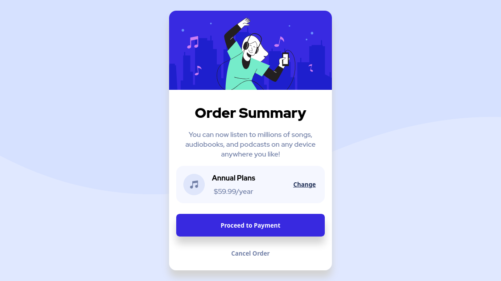

# Frontend Mentor - Order summary card solution

This is a solution to the [Order summary card challenge on Frontend Mentor](https://www.frontendmentor.io/challenges/order-summary-component-QlPmajDUj). Frontend Mentor challenges help you improve your coding skills by building realistic projects. 

## Table of contents

- [Overview](#overview)
  - [The challenge](#the-challenge)
  - [Screenshot](#screenshot)
  - [Links](#links)
- [My process](#my-process)
  - [Built with](#built-with)
  - [What I learned](#what-i-learned)
  - [Useful resources](#useful-resources)
- [Author](#author)

## Overview

### The challenge

Users should be able to:

- See hover states for interactive elements

### Screenshot



### Links

- Solution URL: [Add solution URL here](https://your-solution-url.com)
- Live Site URL: [Add live site URL here](https://your-live-site-url.com)

## My process

### Built with

- Semantic HTML5 markup
- CSS custom properties
- Flexbox

### What I learned

I learn how to use BEM and get started with it

```html
  <div class="plan-status">
    
    <div class="plan-status__price-tag">
        <p class="plan-status__price-tag__title">Annual Plans</p>
        <p class="plan-status__price-tag__price">$59.99/year</p>
    </div>
    <button class="plan-status__change-button">Change</button>
  </div>
```

### Useful resources

- [BEM Introduction](http://getbem.com/introduction/) - An introduction to BEM, from here maybe I'll read more about BEM and use it for my vanilla web project
- [Mozilla Developer Network](https://developer.mozilla.org/en-US) - have amazing docs and resources about JS and CSS.

## Author

- Frontend Mentor - [@nawwab](https://www.frontendmentor.io/profile/nawwab)

