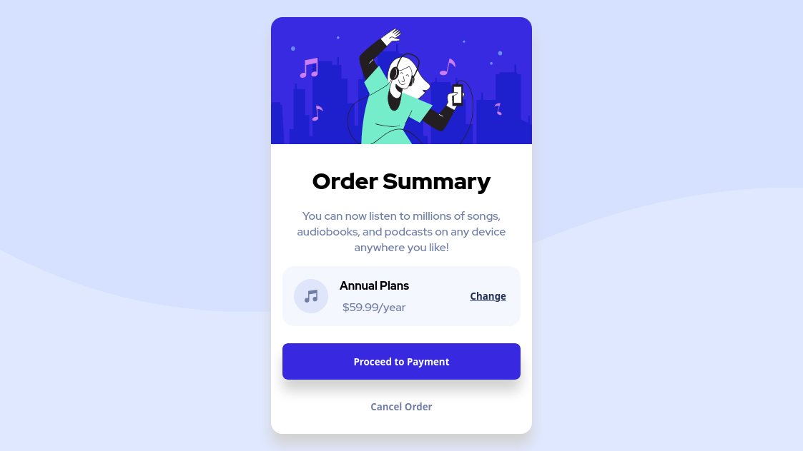

# Frontend Mentor - Order summary card solution

This is a solution to the [Order summary card challenge on Frontend Mentor](https://www.frontendmentor.io/challenges/order-summary-component-QlPmajDUj). Frontend Mentor challenges help you improve your coding skills by building realistic projects. 

## Table of contents

- [Overview](#overview)
  - [The challenge](#the-challenge)
  - [Screenshot](#screenshot)
  - [Links](#links)
- [My process](#my-process)
  - [Built with](#built-with)
  - [What I learned](#what-i-learned)
  - [Useful resources](#useful-resources)
- [Author](#author)

**Note: Delete this note and update the table of contents based on what sections you keep.**

## Overview

### The challenge

Users should be able to:

- See hover states for interactive elements

### Screenshot



### Links
- Live Preview: https://codesandbox.io/s/order-summary-card-btqoc or go to my CodeSandbox profile
- Solution URL: https://www.frontendmentor.io/solutions/vanilla-css-bem-methodology-jIy4n0cVq

## My process

### Built with

- Semantic HTML5 markup
- CSS custom properties
- Flexbox

### What I learned

In this project I learn BEM css to tidying up the stylesheet and playing with HTML and CSS like an old days.

```html
  <div class="plan-status">
    
    <div class="plan-status__price-tag">
        <p class="plan-status__price-tag__title">Annual Plans</p>
        <p class="plan-status__price-tag__price">$59.99/year</p>
    </div>
    <button class="plan-status__change-button">Change</button>
  </div>
```

### Useful resources

- [BEM introduction](http://getbem.com/introduction)
- [Mozilla Developer Network](https://developer.mozilla.org)

## Author

- Frontend Mentor - [@nawwab](https://www.frontendmentor.io/profile/nawwab)

